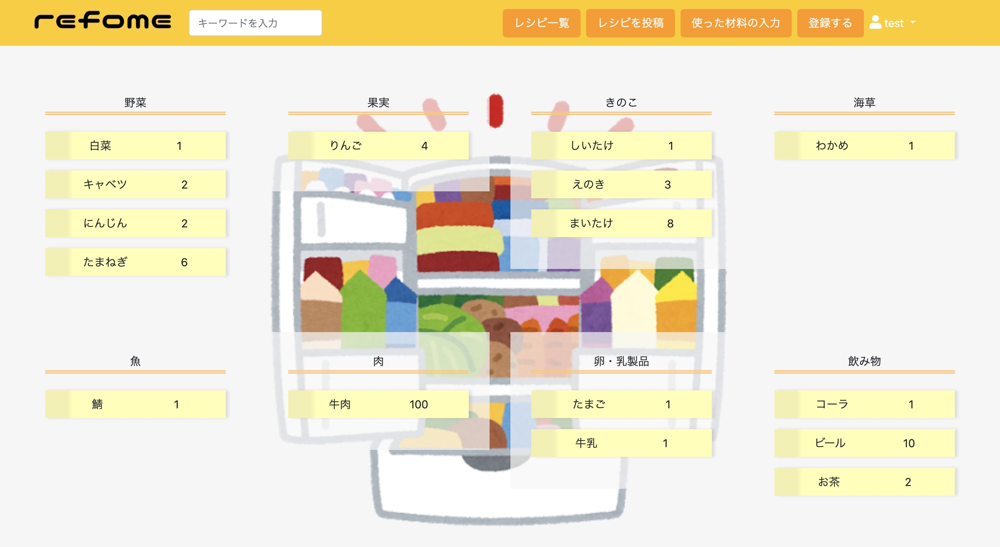
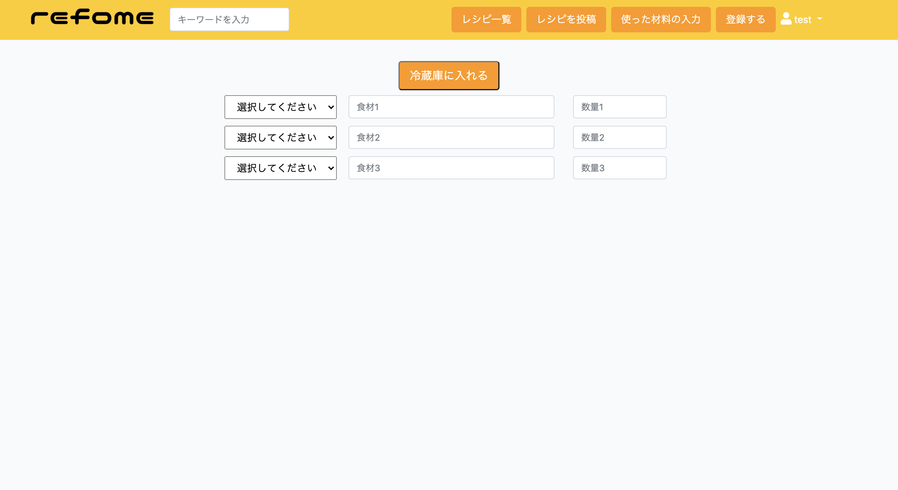
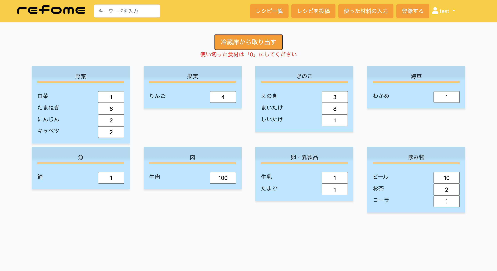
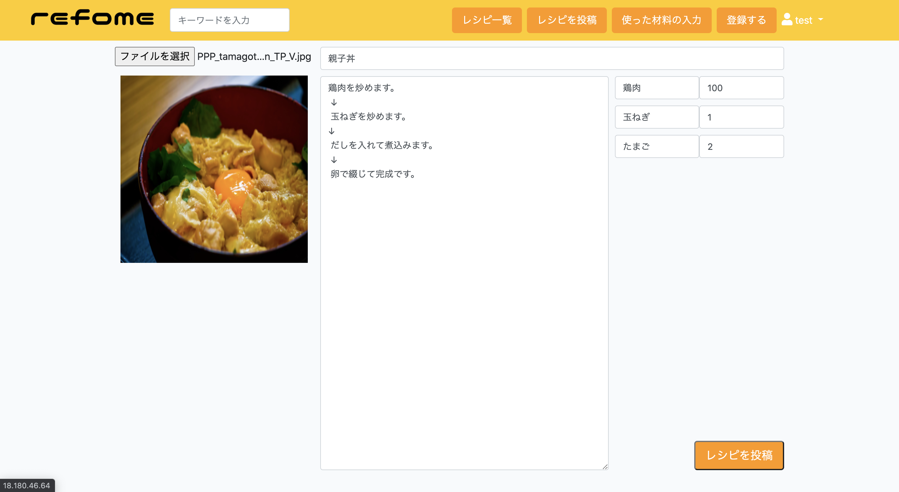

# refome

## 概要
【本番環境】http://18.180.46.64/  
冷蔵庫の中に何入ってたっけ？と忘れたり、スーパーで買ってきたが冷蔵庫に残っていた！ということはありませんか？ 
refomeでは冷蔵庫に残っている食材を管理することが出来ます。 
また、作った料理のレシピを投稿することもできます。 
レシピは公開されますので気に入ったレシピには「いいね」をあげましょう！ 

## テストアカウント
* username【test】
* Email&emsp;&emsp;【test@test.com】
* password【11111111】

## 開発環境
* macOS Catalina10.15.5
* PHP 7.3.11 
* laravel/framework 6.18.15  
* HTML/SCSS
* JavaScript/JQuery
* Bootstrap 4
* mySQL5.6.47
* AWS(EC2,S3,RDS)

## 実装内容
* ユーザー機能 
ユーザー登録、ログイン、ログアウトができます。 
同じメールアドレスでは登録出来ない様になっております。
* 冷蔵庫に食材を入れる、取り出す 
買ってきた食材を登録できます。また、使った食材は「取り出す」ことで冷蔵庫から削除できます。 
最大3種類まで同時に登録が可能です。 
今、冷蔵庫に何が入っているかはトップページで確認できます。 

* いいね機能 
気に入ったレシピにはいいねをつけることができます。 
いいねの数はカウントして表示されます。 
</img>
</img>
* レシピを投稿する 
自分の作った料理をみんなにシェアできます。 
使った食材は自動的に冷蔵庫から消費されます。 

## 今後実装したいこと
* 一度に登録できる食材の数を増やす
* googleを用いたログイン、会員登録
